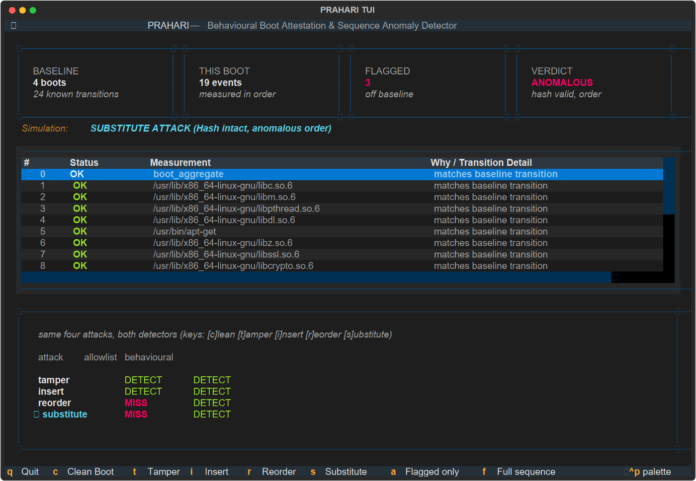

# PRAHARI

[](https://github.com/basithladdu/prahari/actions)
[](https://opensource.org/licenses/MIT)
[](https://www.python.org/)
[-10b981.svg)](https://csrc.nist.gov/pubs/fips/204/final)
[](https://www.meity.gov.in/)

Catches a compromised boot even when every signature checks out fine.

Built for the C-DAC / MeitY AI Enabled Operating System Hackathon 2026.
Track: AI Usage at OS & Kernel Level.
Problem: *AI-Assisted Secure Boot & Integrity Verification*.

## Why we built it

Right now, checking whether your machine booted safely works like a guest list.
You keep a list of known-good file hashes. Every file that loads gets checked
against the list. If it's on the list, it's fine. Keylime, the main open-source
tool for this, works exactly this way.

The problem is that the good attacks don't break hashes.

BlackLotus got past UEFI Secure Boot by bringing along real Microsoft-signed
files that happened to have a bug in them. Every signature was genuine. Every
hash was on the list. The machine got owned anyway. Bootkitty did the same
thing to Ubuntu.

A guest list can't catch that, because nothing on the list is wrong.

So we look at something else: the **order** things load in. Your machine boots
the same way every time. If the same files show up in an order they've never
shown up in before, something changed — even if every file is legitimate.

## How it works

The kernel already writes down every file it loads, in order, in a plain text
file at `/sys/kernel/security/ima/ascii_runtime_measurements`. We read that.

1. **Boot a few times normally.** That's our baseline — this is what normal
   looks like on this machine.
2. **Boot again, compare.** We flag three things:

| What we found | What it means | Does a guest list catch it? |
|---|---|---|
| `tampered` | file we know, hash we don't | yes |
| `unknown` | file that's never loaded before | yes |
| `sequence` | normal files, weird order | **no** |

That last row is the whole point.

3. **Sign the result.** We sign the list of what loaded with two keys — a normal
   one (ECDSA) and a quantum-safe one (ML-DSA-65). Both have to check out. This
   is the pattern RFC 9019 recommends, and it's what the problem statement asks
   for.
4. **Explain it.** Claude writes up what we found in plain English. It only
   describes findings we already made — it never decides anything itself, so it
   can't invent a problem or hide one.

## The interface

It's a terminal app, built on [Textual](https://github.com/Textualize/textual).
Boot integrity gets checked on servers over ssh, so that's where the tool lives.

```bash
prahari ui boots/
```



The table displays every measurement in the order it occurred, with anomalies clearly highlighted. The bottom panel continuously benchmarks all four attack vectors against both detectors.

### Interactive Live Demo Controls
* `c` → **Clean Boot** (Unmodified holdout sequence)
* `t` → **Tamper** (Direct hash corruption)
* `i` → **Insert** (Rogue injected kernel module)
* `r` → **Reorder** (Permuted valid events — hash matches, order fails)
* `s` → **Substitute** (Relocated signed binary — BlackLotus vector)
* `a` → **Flagged Only** toggle
* `f` → **Full Sequence** view
* `q` → **Quit**

You can also generate an interactive HTML visualizer with timeline swimlanes, KPI cards, and event inspector:
```bash
python -m prahari.cli check boots/boot-0.log --viz boot.html
```

## Try it

You need a Linux VM. Not WSL2 — WSL2 has no TPM.

```bash
sudo bash scripts/setup_ima.sh   # turn on measurement, then reboot
sudo bash scripts/capture.sh     # run after each reboot, 4-5 times
python -m prahari.cli learn boots/*.log
python -m prahari.cli check boots/boot-latest.log --viz boot.html
```

No VM handy? This makes fake boot logs so you can see it work right now:

```bash
python scripts/synthesize.py 5
python -m prahari.cli demo boots/*.log
```

Which prints:

```
attack       allowlist    prahari      caught by
tamper       DETECT       DETECT       tampered
insert       DETECT       DETECT       sequence,unknown
reorder      MISS         DETECT       sequence
substitute   MISS         DETECT       sequence
```

`substitute` is the BlackLotus one — we move a real, properly signed file to a
point in the boot where it never normally appears. Its hash is fine. The guest
list shrugs. We catch it.

## Why we didn't use a neural net

DeepLog and LogBERT are the usual picks for this kind of thing, and they're
good. But they want thousands of examples to learn from. You can reboot a
laptop maybe ten times before a deadline.

So we count sequences of three instead. It works after four or five boots, and
every alert points at a specific transition you can print and read. Nothing is
hidden inside weights. The neural net version is worth doing when you have a
fleet of machines feeding you data — not for one laptop.

## What you need

- Linux with `CONFIG_IMA` on (Ubuntu Server has it)
- OpenSSL 3.5 or newer, for the quantum-safe signing
- Python 3.9+
- `ANTHROPIC_API_KEY` only if you want the written explanations

You don't need a TPM chip. IMA still writes its log without one, which is why
this runs in a plain VM. If you do have a TPM (or `swtpm` under QEMU), we can
also read the firmware measurements and cover more of the boot.

## What we used vs what we wrote

Ours: the log parser, the tokenizer, the baseline model, the detector, and the
attack generator.

Borrowed:

| Thing | Licence | What for |
|---|---|---|
| OpenSSL 3.5 | Apache-2.0 | ML-DSA-65 and ECDSA signing |
| plotly | MIT | the boot chart |
| anthropic | MIT | writing up findings |
| tpm2-tools | BSD-3 | reading TPM logs (optional) |

## Data

There's no public collection of boot logs anywhere, so we make our own. Boot a
clean machine a few times for the baseline, then mess with those logs in four
ways we document: `tamper`, `insert`, `reorder`, `substitute`. Boot logs only
contain file paths and hashes — no personal data, nothing leaves the machine.

## Licence

MIT. See [LICENSE](LICENSE).
